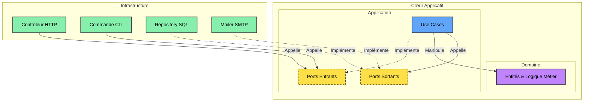

<div flex="~ col gap-4 items-center justify-center" h-full>
  <div font-serif text-6xl>Architecture Hexagonale</div>
  <div op60 text-2xl>Du Spaghetti au Code Propre en PHP</div>
</div>

<div class="abs-br m-10 text-sm op50">
  Ports & Adapters — Alistair Cockburn, 2005
</div>

<!--
Aujourd'hui je vais parler d'un sujet qui change vraiment la façon d'écrire du code métier durable : l'architecture hexagonale.
-->

---
layout: center
glow: false
---

<Toc minDepth="1" maxDepth="1" />

---
layout: section
glowSeed: 12
---

# Le Constat de départ
Le Code Couplé

---
class: text-xl
---

<div font-serif text-3xl mb8>Un contrôleur PHP "classique"</div>

Inscription d'un utilisateur — validation, persistance, email, réponse : tout dans la même classe.

```php {8-13|15-19|21-27|all}
class RegistrationController extends Controller
{
    public function register(Request $request)
    {
        // 1. Validation HTTP directe
        $request->validate([/* ... */]);

        // 2. Logique métier + Persistance (Eloquent couplé)
        $user = new User();
        $user->username = $request->input('username');
        $user->email = $request->input('email');
        $user->password = password_hash(...);
        $user->save(); // Couplage direct MySQL

        // 3. Email (SMTP + PHPMailer en dur)
        $mail = new PHPMailer(true);
        $mail->isSMTP();
        $mail->Host = env('MAIL_HOST');
        $mail->send();

        // 4. Réponse HTTP
        return response()->json([
            'message' => 'Utilisateur créé !',
        ], 201);
    }
}
```

---
layout: none
class: h-full
glow: right
---

<div h-full flex="~ col justify-center" px20>

<div font-serif text-4xl mb10>Trois failles architecturales</div>

<div grid="~ cols-3 gap-6">
  <div v-click p5 rounded-xl bg-red:10 border="~ red:30">
    <div i-ph-warning-duotone text-red text-3xl mb3 />
    <div text-xl mb2>SOLID violé</div>
    <div op60 text-sm>Une classe fait tout : HTTP, validation, hachage, persistance, email.</div>
  </div>
  <div v-click p5 rounded-xl bg-amber:10 border="~ amber:30">
    <div i-ph-test-tube-duotone text-amber text-3xl mb3 />
    <div text-xl mb2>Intestable</div>
    <div op60 text-sm>Il faut une vraie BDD et un serveur SMTP pour tester la moindre règle métier.</div>
  </div>
  <div v-click p5 rounded-xl bg-purple:10 border="~ purple:30">
    <div i-ph-lock-key-duotone text-purple text-3xl mb3 />
    <div text-xl mb2>Vendor Lock-in</div>
    <div op60 text-sm>Le métier est soudé à Laravel. Migrer = tout réécrire.</div>
  </div>
</div>

</div>

<!--
Trois symptômes du même mal : le code métier est prisonnier des détails techniques.
-->

---
layout: statement
glow: center
glowSeed: 3
---

<div font-serif text-5xl>Le code métier ne devrait<br>rien savoir de son infrastructure</div>

---
layout: section
glowSeed: 20
---

# Qu'est-ce que
# l'Architecture Hexagonale ?
Ports & Adapters

---
class: text-xl
glow: false
---

<div font-serif text-3xl mb6>L'objectif</div>

Isoler le <b>code métier</b> de toutes les contraintes externes.

<div v-click mt8 op75>
L'application devient un système fermé et autonome — le <b>Cœur Applicatif</b> — qui ne parle à l'extérieur qu'au travers de contrats bien définis : les <b>Ports</b>.
</div>

<div v-click mt10 flex="~ gap-4" text-lg>
  <div px4 py2 rounded-full bg-purple:15 text-purple1>Domaine</div>
  <div px4 py2 rounded-full bg-blue:15 text-blue1>Application</div>
  <div px4 py2 rounded-full bg-amber:15 text-amber1>Ports</div>
  <div px4 py2 rounded-full bg-lime:15 text-lime1>Adaptateurs</div>
</div>

---
layout: center
glow: false
zoom: 0.85
---



---
layout: none
class: h-full
glow: false
---

<div h-full grid="~ cols-2 rows-2" >

<div p10 border="r b main" flex="~ col justify-center" v-click>
  <div text-purple text-sm mb2>01 · Domaine</div>
  <div text-xl>Entités, Value Objects, règles métier pures</div>
  <div op50 text-sm mt2>Aucune dépendance externe — du PHP natif</div>
</div>

<div p10 border="b main" flex="~ col justify-center" v-click>
  <div text-blue text-sm mb2>02 · Application</div>
  <div text-xl>Les Use Cases orchestrent le flux</div>
  <div op50 text-sm mt2>Coordonnent le Domaine, appellent les Ports</div>
</div>

<div p10 border="r main" flex="~ col justify-center" v-click>
  <div text-amber text-sm mb2>03 · Ports</div>
  <div text-xl>Interfaces définissant les frontières</div>
  <div op50 text-sm mt2>Entrants (déclenchent) · Sortants (besoins)</div>
</div>

<div p10 flex="~ col justify-center" v-click>
  <div text-lime text-sm mb2>04 · Adaptateurs</div>
  <div text-xl>Implémentations concrètes de l'Infrastructure</div>
  <div op50 text-sm mt2>Contrôleur HTTP, repository SQL, mailer SMTP</div>
</div>

</div>

---
class: text-xl
glow: bottom
---

<div font-serif text-3xl mb8>Le secret : l'Inversion de Dépendance</div>

<div text-center op60 font-mono text-lg my6>
Contrôleur → Service → Base de Données (ORM)
</div>

<div v-click grid="~ cols-2 gap-6" mt10>
  <div p5 rounded-xl bg-blue:10 border="~ blue:30">
    <div text-blue mb2>Runtime</div>
    <div op75>Contrôleur → Use Case → Adaptateur BDD<br><span op50 text-sm>le flux va de gauche à droite</span></div>
  </div>
  <div p5 rounded-xl bg-purple:10 border="~ purple:30">
    <div text-purple mb2>Compile-time</div>
    <div op75>L'adaptateur dépend de l'interface définie dans l'Application<br><span op50 text-sm>la dépendance pointe vers l'intérieur</span></div>
  </div>
</div>

---
layout: statement
glow: center
glowSeed: 9
---

<div font-serif text-4xl>C'est l'extérieur qui dépend de l'intérieur,<br><span text-gradient>jamais l'inverse.</span></div>

---
layout: section
glowSeed: 31
---

# La Pratique
Le Cœur Applicatif

---
class: text-lg
glow: false
---

<div font-serif text-3xl mb6>Le Domaine : isolation absolue</div>

L'entité `User` encapsule ses propres invariants — email valide, mot de passe fort, hachage sécurisé.

```php {2,5-6|14-16|19-20|all}
class User
{
    private string $id;
    private string $username;
    private string $email;
    private string $passwordHash;

    public function __construct(
        string $id, string $username,
        string $email, string $plainPassword
    ) {
        $this->id = $id;
        $this->username = $username;
        $this->setEmail($email);
        $this->setPassword($plainPassword);
    }

    private function setEmail(string $email): void {
        if (!filter_var($email, FILTER_VALIDATE_EMAIL)) {
            throw new InvalidEmailException($email);
        }
        $this->email = $email;
    }
}
```

<div v-click mt4 text-sm op50>Zéro dépendance : ni framework, ni BDD, ni HTTP.</div>

---

<div font-serif text-3xl mb8>Les Ports : définir les frontières</div>

<div grid="~ cols-2 gap-6" text-sm>
<div v-click>

<div text-amber mb2>Port Sortant — Repository</div>

```php
interface UserRepositoryInterface
{
    public function save(User $user): void;
    public function findByEmail(
        string $email
    ): ?User;
}
```

</div>
<div v-click>

<div text-amber mb2>Port Sortant — Mailer</div>

```php
interface MailerInterface
{
    public function sendWelcomeEmail(
        User $user
    ): void;
}
```

</div>
</div>

---
layout: section
glowSeed: 45
---

# Application & Infrastructure
Use Cases, DTOs et Adaptateurs

---
class: text-sm
glow: false
---

<div font-serif text-3xl mb6>Le Use Case : `RegisterUser`</div>

Injection des ports via le constructeur — aucune dépendance concrète.

```php {1-6|8-13|15-21|23-24|all}
class RegisterUser
{
    public function __construct(
        private UserRepositoryInterface $userRepository,
        private MailerInterface $mailer
    ) {}

    public function execute(RegisterUserRequest $request): RegisterUserResponse
    {
        if ($this->userRepository->existsByUsername($request->username)) {
            throw new \DomainException("Nom d'utilisateur déjà utilisé.");
        }

        $user = new User(
            bin2hex(random_bytes(16)),
            $request->username,
            $request->email,
            $request->password
        );

        $this->userRepository->save($user);
        $this->mailer->sendWelcomeEmail($user);

        return RegisterUserResponse::fromEntity($user);
    }
}
```

---
class: text-lg
glow: right
---

<div font-serif text-3xl mb8>Adaptateurs : deux canaux, un seul Use Case</div>

<div grid="~ cols-2 gap-8">
  <div v-click flex="~ col gap-3 items-center" p6 rounded-xl bg-white:5>
    <div i-ph-globe-duotone text-4xl text-blue />
    <div text-lg>RegisterUserController</div>
    <div op50 text-sm text-center>Contrôleur HTTP, décode le JSON, appelle le Use Case</div>
  </div>
  <div v-click flex="~ col gap-3 items-center" p6 rounded-xl bg-white:5>
    <div i-ph-terminal-window-duotone text-4xl text-lime />
    <div text-lg>RegisterUserCommand</div>
    <div op50 text-sm text-center>Commande CLI Symfony, mêmes arguments, même Use Case</div>
  </div>
</div>

<div v-click mt10 text-center op60>Aucune modification du code métier entre les deux</div>

---
class: text-sm
glow: false
---

<div font-serif text-3xl mb6>Arborescence recommandée</div>

```text
src/
├── Domain/
│   ├── Entity/User.php
│   ├── Repository/UserRepositoryInterface.php   ← Port Sortant
│   └── Gateway/MailerInterface.php              ← Port Sortant
├── Application/
│   ├── UseCase/RegisterUser.php
│   └── DTO/{RegisterUserRequest, RegisterUserResponse}.php
└── Infrastructure/
    └── Adapter/
        ├── Http/RegisterUserController.php      ← Entrant
        ├── Cli/RegisterUserCommand.php           ← Entrant
        ├── Persistence/SqlUserRepository.php     ← Sortant
        │            /InMemoryUserRepository.php  ← Sortant (tests)
        └── Mailer/SmtpMailer.php                 ← Sortant
```

<div v-click mt4 op50>Séparation visuelle immédiate entre règles métier, orchestration et détails techniques.</div>

---
layout: section
glowSeed: 58
---

# Concepts Avancés

---
class: text-lg
glow: false
---

<div font-serif text-3xl mb6>La stratégie de test ultime</div>

Remplacer les mocks complexes par des <b>implémentations en mémoire</b> des ports.

```php {1-6|8-13}
class InMemoryUserRepository implements UserRepositoryInterface
{
    private array $users = [];
    public function save(User $user): void {
        $this->users[$user->getId()] = $user;
    }
}

class InMemoryMailer implements MailerInterface
{
    private array $sentEmails = [];
    public function sendWelcomeEmail(User $user): void {
        $this->sentEmails[] = $user;
    }
}
```

<div v-click mt4 flex="~ items-center gap-2" text-lime>
  <div i-ph-lightning-duotone text-xl />
  <div>Aucune BDD, aucun SMTP — exécution en moins de 2 ms</div>
</div>

---
class: text-lg
glow: bottom
---

<div font-serif text-3xl mb8>Contrôler l'architecture avec Deptrac</div>

```yaml
deptrac:
  ruleset:
    Domain: [~]                    # isolé, ne dépend de rien
    Application: [Domain]          # dépend seulement du Domaine
    Infrastructure: [Application, Domain]
```

<div v-click mt6 flex="~ items-center gap-2" op75>
  <div i-ph-shield-check-duotone text-xl text-purple />
  <div><code>vendor/bin/deptrac</code> fait échouer la CI en cas de violation.</div>
</div>

---
layout: two-cols
layoutClass: gap-10
glow: false
---

<div font-serif text-2xl mb6>Avantages</div>

<v-clicks>

- Testabilité maximale
- Indépendance technologique
- Code métier protégé
- Parallélisation des équipes

</v-clicks>

::right::

<div font-serif text-2xl mb6>Inconvénients</div>

<v-clicks>

- Verbosité, plus de fichiers
- Courbe d'apprentissage
- Coût d'indirection

</v-clicks>

---
layout: none
class: h-full
glow: full
glowSeed: 66
---

<div h-full flex="~ col justify-center" px20>

<div grid="~ cols-2 gap-8">
  <div v-click p6 rounded-xl bg-lime:10 border="~ lime:30">
    <div i-ph-check-circle-duotone text-lime text-3xl mb3 />
    <div text-xl mb3>À utiliser</div>
    <div op70 text-sm leading-relaxed>
      Projets moyens/grands, logique métier riche, applications conçues pour durer, tests automatisés poussés.
    </div>
  </div>
  <div v-click p6 rounded-xl bg-red:10 border="~ red:30">
    <div i-ph-x-circle-duotone text-red text-3xl mb3 />
    <div text-xl mb3>À éviter</div>
    <div op70 text-sm leading-relaxed>
      CRUD pur sans règles métier, micro-services passe-plat, prototypes et MVP jetables.
    </div>
  </div>
</div>

</div>

---
layout: center
class: text-center
glow: center
glowSeed: 2
---

<div font-serif text-3xl mb10>Conclusion</div>

<div grid="~ cols-3 gap-6" text-left>
  <div v-click p5 rounded-xl bg-blue:10>
    <div text-blue mb2>Code testable</div>
    <div op70 text-sm>InMemoryUserRepository remplace mocks et BDD réelle</div>
  </div>
  <div v-click p5 rounded-xl bg-purple:10>
    <div text-purple mb2>Indépendance techno</div>
    <div op70 text-sm>Eloquent → Doctrine, SMTP → Mailgun : zéro impact métier</div>
  </div>
  <div v-click p5 rounded-xl bg-lime:10>
    <div text-lime mb2>Flexibilité</div>
    <div op70 text-sm>HTTP et CLI partagent le même Use Case</div>
  </div>
</div>

<div v-click mt12 text-lg op60>
Plus de fichiers, plus de rigueur — un métier protégé de l'obsolescence.
</div>

---
layout: intro
class: text-center
glow: center
glowSeed: 1
---

<div font-serif text-5xl mb6>Merci !</div>

<div op60>Article complet sur <a href="https://alexvolkihar.ovh/posts/hexagonal-architecture-fr">alexvolkihar.ovh</a></div>
